# 🍷 Wine ML Pipeline - From Research to Production

<div align="center">


**End-to-end ML pipeline for wine quality prediction: from EDA notebooks to a production API.**

</div>

---

## 🌟 What This Does

Ever wondered if you could predict wine quality from chemical properties? This project takes you through the entire journey:

- **Research Phase:** EDA notebooks exploring what makes wine good
- **Pipeline Development:** Modular components for data processing and model training  
- **Production Deployment:** Flask API with Docker containers ready for the real world

The result? A Random Forest model that beats baseline predictions by 50%+ and serves predictions via a clean REST API.

---

## 🖼️ Key Results

<div align="center">

### 📊 **Research Insights**

*Distrubition of the Target*

*What features actually matter for wine quality*

*Featuresimportance*

### 📈 **Model Performance**

*Our model vs reality - pretty close!* 


</div>

**Performance at a glance:**

| Model         | RMSE | MAE  | R²     | Improvement    |
| ------------- | ---- | ---- | ------ | -------------- |
| Just guessing | 0.81 | 0.69 | -0.006 | -              |
| My model      | 0.55 | 0.42 | 0.53   | **53% better** |

---

## ⚡ Quick Start

Get up and running in 30 seconds:

```bash
# Setup
python -m venv .venv
source .venv/bin/activate  # PowerShell: .venv\Scripts\Activate.ps1
pip install -r requirements.txt
pip install -e .

# Train the model
python main.py

# Start the API
python app.py  # Serves on localhost:8000
```

Test it out:
```bash
# Try a prediction
python sample_payload.py | curl -s -X POST http://localhost:8000/predict \
  -H "Content-Type: application/json" -d @-
```

---

## 🔧 How It Works

```mermaid
graph TD
    A[Wine Data] --> B[Clean & Validate]
    B --> C[Feature Engineering]
    C --> D[Train Model]
    D --> E[Evaluate & Diagnose]
    E --> F[Deploy API]
    F --> G[🍷 Predict Quality!]
```



The pipeline is designed to be **config-driven** and **modular**. Want to try a different model? Edit `params.yaml`. Need different data? Update `config/config.yaml`. Everything just works.

---

## 🌐 API Usage

| Endpoint        | What It Does                  |
| --------------- | ----------------------------- |
| `GET /health`   | Check if everything's running |
| `POST /predict` | Get wine quality predictions  |

**Example request:**
```json
{
  "data": [
    {
      "fixed acidity": 7.4,
      "volatile acidity": 0.7,
      "citric acid": 0.0,
      "residual sugar": 1.9,
      "chlorides": 0.076,
      "free sulfur dioxide": 11.0,
      "total sulfur dioxide": 34.0,
      "density": 0.9978,
      "pH": 3.51,
      "sulphates": 0.56,
      "alcohol": 9.4
    }
  ]
}
```

**You get back:**
```json
{
  "n": 1,
  "predictions": [5.01]
}
```

---

## 🗂️ Project Structure

```

├── app.py                  # Flask API
├── main.py                 # Pipeline runner
├── config/                 # Configuration files
├── src/datascience/        # The actual ML pipeline
│   └── components/         # Modular pipeline pieces
├── research/               # EDA notebooks
├── artifacts/              # Model outputs & results
└── tests/                  # Because testing matters
```


Each component does one thing well:
- **DataIngestion:** Loads and validates your CSV
- **DataTransformation:** Splits data and handles scaling
- **ModelTrainer:** Trains your model (RF by default, configurable)
- **ModelEvaluation:** Compares against baseline and generates metrics
- **ModelDiagnostics:** Creates visualizations and reports

---

## 🐳 Docker Deployment

We've made deployment dead simple:

```bash
# Build locally
docker build -t wine-api:local .
docker run --rm -p 8000:8000 wine-api:local

# Or pull our pre-built image
docker pull ghcr.io/<owner>/<repo>:v0.2.1
```

The Docker image includes everything - data, trained model, the works. Perfect for demos or production.

---

## 🔬 Research Highlights

The `research/` folder contains the exploration that led to this pipeline. Key findings:

- **Alcohol content** is the strongest predictor (who knew? 🍾)
- **Volatile acidity** is a major quality killer
- **Sulphates** add that special something

Want to dig deeper? Check out the EDA notebooks - they're fully reproducible.

---

## 🛠️ Customization

Everything is configurable:

- **Try different models:** Edit the `model` section in `params.yaml`
- **Change preprocessing:** Swap scalers or adjust train/test split
- **Add features:** Update the schema in `config/schema.yaml`

The pipeline will adapt automatically. We've done the hard work of making it flexible.

---


## 🧪 Testing & Quality

We take quality seriously:

```bash
pytest  # Run all tests
```

Our tests cover:
- Data contracts and schema validation
- Pipeline shape integrity
- Model artifacts and API endpoints
- End-to-end prediction workflow

---


## 🚀 What's Next

We're not done yet! Coming soon:

- [ ] Hyperparameter optimization with MLflow tracking
- [ ] Model versioning and registry integration  
- [ ] Advanced visualizations and monitoring dashboards
- [ ] More sophisticated feature engineering

---


## 🤝 Contributing

Found a bug? Have an idea? We'd love your help! 

- Open an issue for bugs or feature requests
- Submit a PR with your improvements
- Check out [CONTRIBUTING.md](CONTRIBUTING.md) for guidelines

---

## 📚 Citation

If this helps your research:

```bibtex
@software{fitsblb_wine_ml_pipeline,
  author = {fitsblb},
  title = {Wine ML Pipeline: From Research to Production},
  year = {2025},
  url = {https://github.com/fitsblb/wine-ml-pipeline}
}
```

---

## 🙏 Acknowledgments

Built with love using the amazing Python ML ecosystem. Special thanks to the scikit-learn team and the open-source community that makes projects like this possible.

---

**Ready to predict some wine quality? Let's get started! 🍷**

---

<details>
<summary>📋 <strong>Detailed Technical Reference</strong> (click to expand)</summary>

### Configuration Details

**config/config.yaml:** Defines all paths and I/O settings. Paths are relative to the config folder and automatically resolved to absolute paths.

**params.yaml:** Controls model selection, preprocessing options, and evaluation settings.

### Pipeline Components

Each component in `src/datascience/components/` is self-contained:

- `DataIngestion`: Robust CSV loading with configurable separators
- `DataValidation`: Schema compliance checking
- `DataTransformation`: Train/test splitting with optional scaling
- `ModelTrainer`: Model training with artifact generation
- `ModelEvaluation`: Performance comparison against baseline
- `ModelDiagnostics`: Visualization and reporting generation

### API Implementation

The Flask API uses an application factory pattern with proper error handling and CORS support. Model loading happens at startup for optimal performance.

### Docker Architecture

Multi-stage build process:
1. **Builder stage:** Installs dependencies and trains model
2. **Runtime stage:** Minimal image with only necessary artifacts
3. **Security:** Runs as non-root user with proper permissions

### Testing Strategy

Comprehensive test coverage including:
- Data contract validation
- Pipeline integration tests  
- API endpoint testing
- Artifact generation verification

</details>
## 🚀 Pipeline Modules & Workflow

### 📥 **Data Ingestion**
- Reads CSV using `io.csv_sep` from config.
- Ensures robust loading for both local and Docker environments.

### ✅ **Data Validation**
- Checks target and required columns (data contract).
- Guarantees schema compliance before processing.

### 🔄 **Data Transformation**
- Train/test split with optional scaling (`standard` | `minmax` | `none`).
- Writes `X_*`, `y_*`, and `scaler.joblib` artifacts for reproducibility.

---

## 🧪 **Testing & Quality Gates**

| Test File                             | Purpose                                      |
| ------------------------------------- | -------------------------------------------- |
| `test_data_contract.py`               | File + required columns exist                |
| `test_pipeline_shapes.py`             | Split shape integrity, scaler artifact check |
| `test_target_range_and_duplicates.py` | Target range + duplicate ratio               |
| `test_eval_artifacts_exist.py`        | Key evaluation artifacts exist               |

---

## 📊 **EDA Highlights**

- Notebook: `research/1_data_ingestion.ipynb` for sanity checks.
- Artifacts: histogram, correlation heatmap, scatter plots, `eda_report.md`.
- **Top features (|corr|):** `alcohol`, `volatile acidity`, `sulphates`.

---

## 🤖 **Modeling & Evaluation**

- **Trainer:** `ModelTrainer(params, cfg)` — default: `RandomForestRegressor` (params from `params.yaml`).
- **Artifacts:** `model.joblib`, `features.json` (feature order for inference).
- **Evaluation:** `ModelEvaluation(params, cfg)` — baseline (train-mean predictor), metrics saved to `metrics.json`.

| Model    | RMSE | MAE  | R²     |
| -------- | ---- | ---- | ------ |
| Baseline | 0.81 | 0.69 | -0.006 |
| RF Model | 0.55 | 0.42 | 0.53   |

---

## 🩺 **Diagnostics & Reporting**

- `ModelDiagnostics(params, cfg)` creates:
  - `residuals_hist.png`
  - `pred_vs_true.png`
  - `error_by_target.png`
  - `feature_importance.(json|png)`
  - `report.md` (quick summary)

---

## 🌐 **Serving API**

- **Framework:** Flask app factory (`create_app()`) in `app.py` with CORS.
- **Endpoints:**
  - `GET /health` → `{status: ok, model_dir: ...}`
  - `POST /predict` → accepts `{ "data": {feat...} }` or list; validates keys vs `features.json`, applies scaler if present, returns predictions.
- **Tests:** `tests/test_api.py` + `tests/conftest.py` (builds artifacts once per session).
- **Sample:** Payload from `sample_payload.py`.  
  Example response: `{"n":1,"predictions":[5.01]}`

---

## 🐳 **Containerization & Publishing**

- **Dockerfile:** Multi-stage build — builder installs deps + package, copies data, runs `python main.py` to bake artifacts; runtime runs non-root and serves.
- **Final CMD:** Gunicorn `app:create_app()` with 2 workers.
- **.dockerignore:** Trims image size, keeps `src/` and raw data.
- **GHCR:**  
  - Workflow `.github/workflows/docker.yml` builds and pushes on tags (`v*.*.*`).
  - Successful tag: `v0.2.1` (and later), pull with:  
    `docker pull ghcr.io/<owner>/<repo>:v0.2.1`

---

## 🗂️ Project Structure

```
wine-ml-pipeline/
├── app.py                        # Flask API entrypoint
├── main.py                       # Pipeline orchestrator
├── config/
│   ├── config.yaml               # Paths, IO, and schema anchors
│   └── schema.yaml               # Data contract
├── params.yaml                   # Model, split, scaler params
├── src/
│   └── datascience/
│       ├── __init__.py
│       ├── config_manager.py
│       ├── params_loader.py
│       ├── README.md             # 📦 Package documentation: pipeline modules, config loaders, usage
│       └── components/
│           ├── __init__.py
│           ├── data_ingestion.py
│           ├── data_validation.py
│           ├── data_transformation.py
│           ├── model_trainer.py
│           ├── model_evaluation.py
│           └── model_diagnostics.py
├── research/                     # EDA notebooks & exploration
├── artifacts/                    # Outputs: splits, models, metrics, plots
├── docs/                         # 📊 Professional documentation & EDA image outputs
│   └── assets/                   # 📊 EDA images, visualizations, and supporting figures
├── tests/                        # CI tests
├── CONTRIBUTING.md               # 🤝 Contribution guidelines
├── .github/workflows/
│   ├── ci.yml                    # Pytest, lint, coverage
│   └── docker.yml                # Docker build & publish
├── Dockerfile                    # Multi-stage, production-ready
└── .dockerignore                 # Slimmer image
```

---

## ⚖️ Decisions & Trade-offs

- **Bake artifacts at build time:**  
  🚀 Fast startup, reproducible demo; Docker image ships with trained model & raw CSV.
- **Config-anchored paths:**  
  🔗 Consistent across local, CI, Docker; requires relative paths (`../`) in YAML.
- **Random Forest default:**  
  🌲 Strong baseline, minimal tuning; swap to linear/other models via `params.yaml`.

---

## 🛠️ Troubles I've Fixed

- **Missing TARGET var:**  
  🏷️ Defined in schema; made notebook cells stateless.
- **Brittle `__file__` path math:**  
  🗺️ Centralized with `ConfigManager`, passing `cfg/params` everywhere.
- **Schema location mismatch:**  
  📁 Moved to `config/`, updated all tests.
- **Pandas observed warning:**  
  ⚠️ Set `observed=True` in `groupby`.
- **Packaging issues in Docker:**  
  📦 Added `__init__.py` to `components/`; non-editable install; kept `src/` in context.

---

## 🚧 Next Steps

- [ ] Pre-commit hooks (`black`, `ruff`, `isort`) & coverage gates in CI
- [ ] Hyperparameter grid search (params-driven) + MLflow tracking
- [ ] DVC or model registry for artifact lineage
- [ ] Pydantic request schema for `/predict`

---

> **Production-focused ML pipeline for wine quality prediction:**  
> Config-driven training, robust tests, metrics, diagnostics, a Flask API, and a Docker image published to GHCR. 🍷🚀


## Features
- Config-anchored paths; schema-validated ingestion.
- Train/test split + optional scaling.
- Random Forest (default) or linear; baseline metrics.
- Diagnostics: residuals, pred-vs-true, error by target, feature importance.
- API: `/health`, `/predict` (single or batch).
- CI: pytest on PRs. Docker image built on tags.

## Quickstart
```bash
## ⚡ Quickstart: From Zero to Prediction

### 1️⃣ **Setup Your Environment**
```bash
python -m venv .venv && source .venv/bin/activate  # PowerShell: .venv\Scripts\Activate.ps1
pip install -r requirements.txt
pip install -e .
```

### 2️⃣ **Train & Build Artifacts**
```bash
python main.py   # Builds splits, trains model, writes metrics & diagnostics
```

### 3️⃣ **Serve the API**
```bash
python app.py    # Runs Flask API on :8000
```

---

## 🍷 **Predict Wine Quality (Local)**

**Bash/WSL:**
```bash
python sample_payload.py | curl -s -X POST http://localhost:8000/predict \
    -H "Content-Type: application/json" -d @-
```
**PowerShell:**
```powershell
python .\sample_payload.py | curl.exe -s -X POST http://localhost:8000/predict `
    -H "Content-Type: application/json" -d @-
```

---

## 🗂️ **Project Layout**

```
app.py                 # Flask app factory (create_app)
main.py                # Pipeline entry: ingest → validate → transform → train → eval → diagnostics
config/                # Config anchor + schema
params.yaml            # Split, preprocessing, model, evaluation
src/datascience/       # Installable package with components
artifacts/             # Outputs: splits, model, metrics, plots
tests/                 # CI tests
```

---

## ⚙️ **Configuration**

- **Paths:** Edit `config/config.yaml` (relative to `config/`, auto-resolved).
- **Models & Scaling:** Edit `params.yaml` to swap model/scaler.

---

## 🌐 **API Endpoints**

| Endpoint        | Description                       |
| --------------- | --------------------------------- |
| `GET /health`   | Status check `{status: "ok"}`     |
| `POST /predict` | Predict wine quality (single/batch) |

**Payload keys must match:**  
`artifacts/model_trainer/features.json`

---

## 🐳 **Docker Deployment**

```bash
docker build -t wine-api:local .
docker run --rm -p 8000:8000 wine-api:local
```

---

## 🚀 **Pre-built GHCR Image**

- **Auto-pushed on tags:** `v*.*.*`
- **Pull latest:**  
    ```bash
    docker pull ghcr.io/<owner>/<repo>:v0.2.1
    ```

---

## 🧪 **Testing**

```bash
pytest -q
```

---

## 🛠️ **Troubleshooting**

- **Wrong columns after read:**  
    Set `io.csv_sep: ";"` in `config.yaml`
- **ModuleNotFoundError:**  
    Run `pip install -e .` and check `src/datascience/__init__.py`
- **Missing components in Docker:**  
    Ensure `src/datascience/components/__init__.py` exists

---

## 📄 **License**

MIT

---

### 🧩 **Core Modules**

- `datascience.config_manager`
- `datascience.params_loader`
- `datascience.components`

---

## 📦 **Package Documentation**

See [Package Documentation](package.md) for pipeline modules, config loaders, and usage examples.

---

## 🏷️ **Versioning**

We use [Semantic Versioning (SemVer)](https://semver.org/):  
Tags follow `vMAJOR.MINOR.PATCH` (e.g., `v1.2.3`).


---